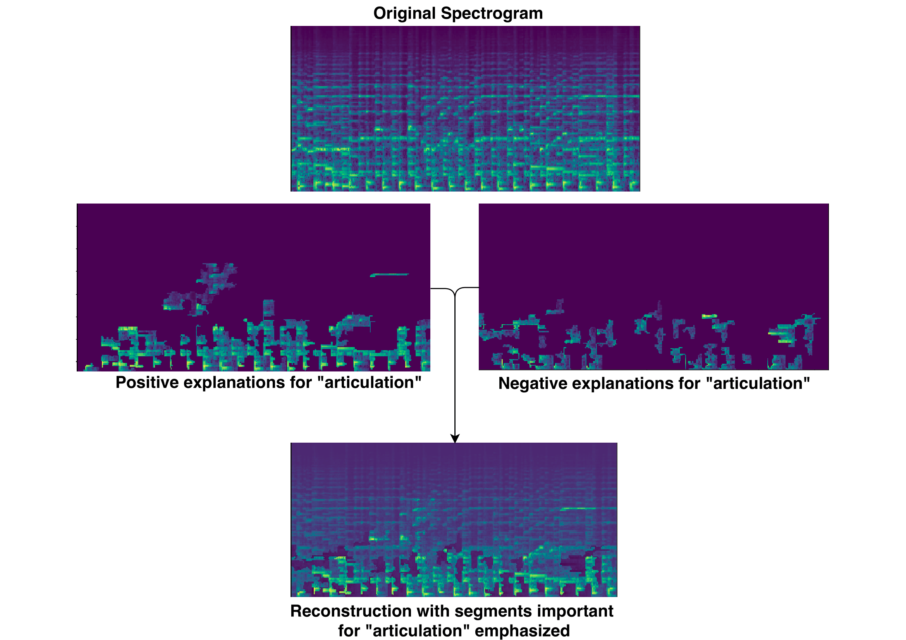
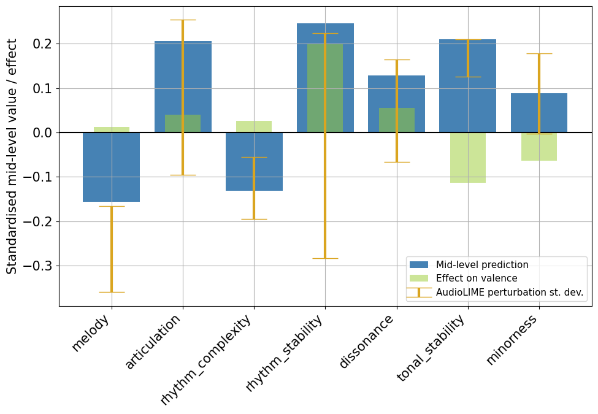
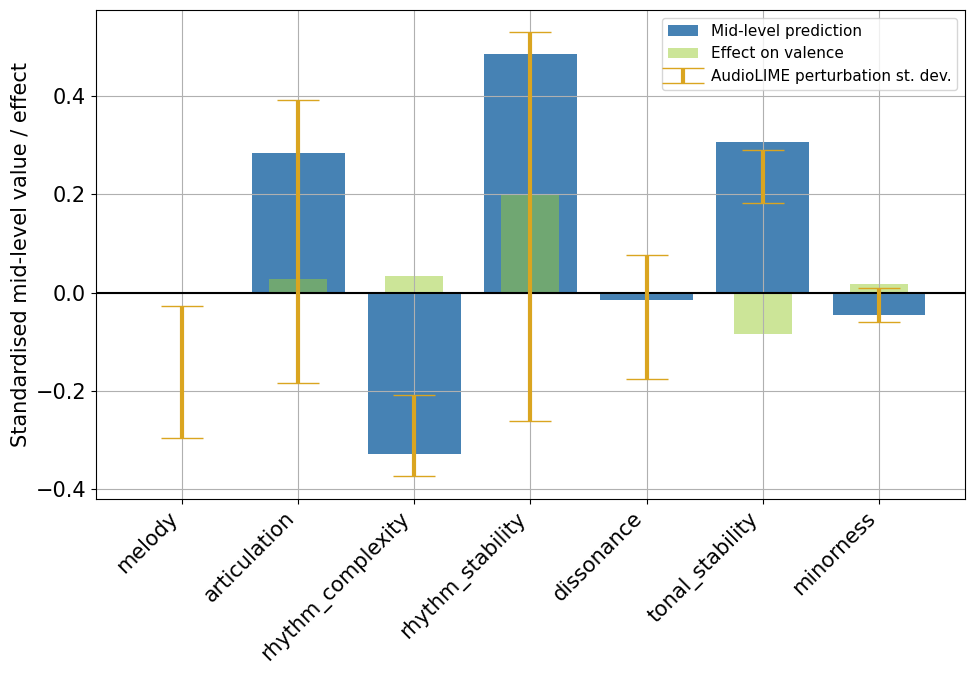

[//]: # (## Modelling Emotional Expression in Music Using Interpretable and Transferable Perceptual Features)

[//]: # (# Audio Examples)

[//]: # ()
[//]: # 

[//]: # ()
[//]: # (
)

[//]: # (## Chapter 5: TRACE: Two-level Explanations using Interpretable Input Decomposition )
[//]: # (Here, we show listenable explanations for mid-level features. )

# Explanations via Spectrogram Segmentation
This method decomposes the input spectrogram into interpretable segments and computes the importance of each segment towards the final mid-level feature prediction using LIME (Local Interpretable Model-agnostic Explanations).

Original audio:
<audio controls="controls">
  <source type="audio/wav" src="assets/audio/thesis_audio/ch5_expl_original.wav"></source>
  
Your browser does not support the audio element.

</audio>
 
Reconstructed audio with explantions for "**articulation**" emphasised:
<audio controls="controls">
  <source type="audio/wav" src="assets/audio/thesis_audio/ch5_expl_modified.wav"></source>
  
Your browser does not support the audio element.

</audio>

 

# Explanations using Sound Sources

This method decomposes the input audio into into instrument stems (vocals, piano, drums, bass, and other) and computes the importance of each stem towards the final mid-level feature prediction using audioLIME.

Below, the plots show the mid-level predictions (in blue) for two audio samples, their effect on valence (in green), and the standard deviation of the mid-level predictions for the perturbed audio samples. The perturbations are generated by audioLIME by using different combinations of the five instrument sources separated from the original audio.

The most important instrument component (explantory source) for rhythm_stability can be listened to below the plots.

## 1. 

Original audio:
<audio controls="controls">
  <source type="audio/wav" src="assets/audio/thesis_audio/962/original.wav"></source>
  
Your browser does not support the audio element.

</audio>
 
Explanatory source for **rhythm_stability** -- (**vocals**):
<audio controls="controls">
  <source type="audio/wav" src="assets/audio/thesis_audio/962/rhythm_stability_explanation.wav"></source>
  
Your browser does not support the audio element.

</audio>

 

## 2. 

Original audio:
<audio controls="controls">
  <source type="audio/wav" src="assets/audio/thesis_audio/929/original.wav"></source>
  
Your browser does not support the audio element.

</audio>
 
Explanatory source for **rhythm_stability** -- (**drums**):
<audio controls="controls">
  <source type="audio/wav" src="assets/audio/thesis_audio/929/rhythm_stability_explanation.wav"></source>
  
Your browser does not support the audio element.

</audio>